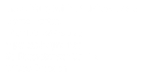

<section class="centered" markdown="1">

# Der Freie-Software-Freies-Wissen-Schulstick
- eine Lern-, Spiel- und Arbeitsplattform für Schüler von der Grundschule bis zum Abschluss
- mit aktueller Freier Software für viele Anwendungsbereiche
- alle Programme offline und ohne Registrierung oder Installation nutzbar
- eigenes Betriebssystem in der Tasche: startet unabhängig von (und ohne Gefahr für) auf dem Rechner installierter Software
- einfache Benutzeroberfläche und verständliche Dokumentation
- Nachinstallieren weiterer Programme möglich
- mit automatischen Sicherheitsupdates
- Funktion, den Stick bei Problemen komplett oder teilweise zurückzusetzen
- auch in weiteren Varianten mit etwas unterschiedlicher Software-Auswahl für unterschiedliche Zielgruppen (Schulstick, Uni-Stick, Makerstick)
- erweiterbar und anpassbar, z.B. auf spezielle Bedürfnisse einer Schule (Stichwort »Schul-Proxy«…)

**Kostenlose Probesticks** gibt es ab sofort für Lehrkräfte aller Schulformen.
Füllen Sie dafür einfach unser [Web-Formular](https://survey.opensourceecology.de/index.php?r=survey/index&sid=281135) aus.

Einige weitere Informationen und Screenshots zum Stick-Projekt finden Sie auf der [Hauptseite](https://github.com/fsfw-dresden/usb-live-linux) dieses Projekts.

</section>
---
<section class="two-columns" markdown="1">

## Download und Bespielen eines USB-Sticks
Die aktuelle Version basiert auf Debian-Linux 12 (stable, codename »bookworm«) mit dem Xfce-Desktop.

Für die Installation des FSFW-Schulsticks braucht es einen USB-Stick guter Qualität mit mindestens 16 (besser 32) Gigabyte Kapazität. Weiterhin braucht man ein spezielles Programm, um das Bespielen durchzuführen. Wir empfehlen dafür den [Etcher](https://www.balena.io/etcher/), den es dort für verschiedene Betriebssysteme zum Download gibt. Wer die Kommandozeile nutzen mag, nimmt auf Linux am besten das [block map tool](https://pkgs.org/search/?q=bmaptool&on=files) (`bmaptool copy [Image-URL (….img.gz)] [USB-Stick-Gerät]`).

Damit einfach die komprimierte Image-Datei auswählen und auf den Stick "flashen". Das Programm verifiziert den erzeugten Stick auch, so dass bei erfolgreich vermeldetem Abschluss der Stick auch funktionieren sollte.
Das Image kann für USB-Sticks mit 16 Gigabyte oder mehr verwendet werden, da sich die Persistenz-Partition beim ersten Start auf die verfügbare Größe anpasst.

> **Image-Datei** (Version 3057j vom 2024-12-06 15 GiB):
> 
> [FSFW-Schulstick_3057j_Xfce_bookworm-amd64.hybrid.img.gz](https://ftp.inf.tu-dresden.de/os/FSFW/FSFW-Schulstick_3057j_Xfce_bookworm-amd64.hybrid.img.gz)
>
> zugehörige **SHA256-Prüfsumme**: `e30c478262c905ce8b917eedb20c9a0043fb02fe3779a689da8c8b425962f6b5`
{: .downloads .right}

</section>
---
<section class="centered" markdown="1">

## Hackathon
📣 … für Schulstick-Anwendungs-Tutorials! 🚀 
Am 11. Dezember um 18 Uhr starten wir mit euch durch und erstellen weitere #OER-Lektionen für die Portal-App auf dem Schulstick. Ziel ist es, Kindern #FLOSS -Apps direkt auf dem #Linux Live-USB-Stick vorzustellen und ihnen die Nutzung dieser zu erklären. Seid dabei & gestaltet die Zukunft der Bildung! ✨ 

👉 Wo? Kommt nach Dresden in den C3D2-Hackspace des Zentralwerks: https://c3d2.de/space.html 
💻 Bitte Laptop mitbringen, falls vorhanden! Ihr bekommt einen #Schulstick mit einem LiaSkript-Editor, mit dem ihr direkt loslegen könnt! 
🥙 Leckeres Essen & 🥤 Getränke warten auf euch! Wir werden bis Mitternacht da sein. 
🌏 Online-Teilnehmende: BigBlueButton-Link wird hier kurz vor Beginn eingestellt.

#Hackathon #EdTech #digitaleBildung #OERde #OpenSource #FediLZ

</section>
---
<section class="centered" markdown="1">

## Verbesserungsvorschläge — Freie Software lebt vom Mitmachen : )
Falls Probleme auftreten, ihr eine Funktion vermisst oder eine Idee habt, wie man etwas besser machen kann: 
einfach auf der [Github-Projekt-Seite](https://github.com/fsfw-dresden/usb-live-linux) oben unter [Issues](https://github.com/fsfw-dresden/usb-live-linux/issues) einen neuen Fall anlegen.

## Förderung durch das Sächsische Staatsministerium für Kultus
Wir sind mit einem Förderantrag im Rahmen der Initiative "Digitale Schule Sachsen" erfolgreich gewesen und freuen uns auf die Chance, mit dieser Unterstützung an einem „Selbstlernportal“ für freie Software arbeiten zu können. Wir finalisieren im Moment die technische Roadmap, um dann die Programmierarbeit auszuschreiben und mit der mediendidaktischen Entwicklung zu beginnen. Kern des Unterfangens ist eine Python/Qt-Portal-App für Open Educational Resources mit Tutorials, Walk-Throughs und Challenges für auf dem Stick vorhandene Software. Wir sind im Augenblick dabei, uns dazu auch didaktische Unterstützung ins Boot zu holen und sind optimistisch, in den nächsten Monaten überzeugende Ergebnisse präsentieren zu können.

## Weitere Pläne
- Barrierefreiheit prüfen und verbessern
- Multisprach-System (=> Grub Boot-Menü)
- international versions (f.e. India, Africa, Ukraine..)
- gemeinsames Build-Framework mit dem [Lernstick](https://lernstick.ch/)
- siehe auch [Developing-TODO.md](https://github.com/fsfw-dresden/usb-live-linux/blob/main/doc/Developing-TODO.md)

</section>
---
<section class="centered" markdown="1">

## Kurzvorstellung des FSFW-Stick-Projekts


</section>
---
<section class="centered" markdown="1">

## Impressum
Eine Initiative der «[Freie Software Freies Wissen Hochschulgruppe Dresden](https://fsfw-dresden.de/)».

</section>
